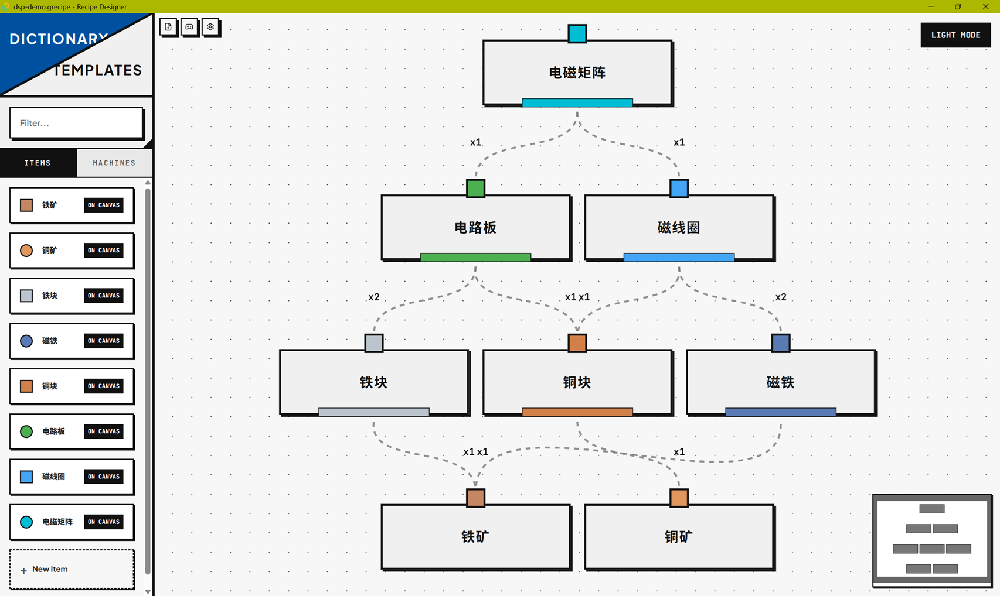
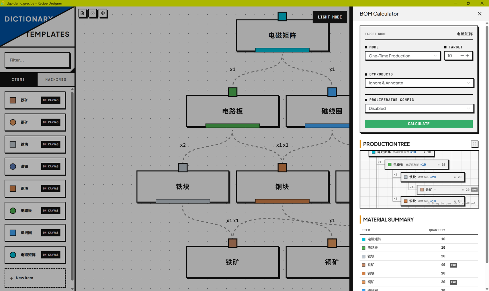

<h1 align="center">Recipe Designer</h1>

<p align="center">
  <strong>A visual factory production line designer and BOM calculator</strong>
</p>

<p align="center">
  
  
  
  
  
</p>

<p align="center">
  <a href="README.zh-CN.md">中文文档</a>
</p>

---

## 📖 Overview

**Recipe Designer** is a desktop application for visually designing, organizing, and analyzing complex factory production lines. Inspired by factory automation games, it lets you model items, machines, recipes, byproducts, catalysts, and global effects — then compute the full Bill of Materials (BOM) to understand exactly what raw resources and machines you need at every step.

Build your production chain as a graph of nodes and edges, configure multiple recipe alternatives per item, balance byproducts, apply productivity multipliers, and export your designs — all through a polished Bauhaus-inspired interface.

## 📸 Screenshots

<p align="center">
  <strong>Main Editor</strong><br/>
  
</p>

<p align="center">
  <strong>BOM Calculator</strong><br/>
  
</p>

## ✨ Features

### Core Editor
- **Visual Graph Editor** — Drag-and-drop node creation, edge connections, group nodes, pan and zoom canvas
- **Multi-Slot Recipes** — Each item can have multiple production recipes; switch between them to compare
- **Three Edge Types** — Input (solid), Byproduct (dashed), and Catalyst (dashed blue) flow connections
- **Group Nodes** — Collapse sub-factories into summary nodes showing aggregated inputs and outputs
- **Auto Layout** — Three layout directions: Top-to-Bottom, Bottom-to-Top, Left-to-Right, powered by sugiyama layout with collision avoidance
- **5 Edge Styles** — Simple Bezier, Default Bezier, Straight, Step, Smooth Step
- **Selection Highlighting** — Click any node or edge to highlight its upstream and downstream connections
- **Dark / Light Themes** — Full theme support with CSS variables

### Recipe & Machine System
- **Machine Editor** — Define machines with base speed, tags, and slot configuration (input, output, catalyst, proliferator)
- **Recipe Slots** — Configure production time, quantity, required machine, and tags per recipe
- **Catalyst System** — Optional/required catalysts with speed multipliers
- **Secondary Outputs** — Model byproducts alongside primary outputs
- **Global Effects** — Apply yield and speed multipliers from skills, treasure, or research, filtered by tags
- **Proliferator Config** — Define proliferator items with per-cycle consumption

### BOM Calculator
- **Production Tree View** — Recursive drill-down showing every input with status flags (cycle detected, catalyst missing, raw material, no recipe)
- **Summary Table** — Aggregated view of all items, quantities, rates, and machine counts
- **Two Modes** — One-time production and continuous production (rate/min)
- **Rounding Options** — Integer ceiling or exact decimal
- **Byproduct Strategies** — Ignore & annotate, offset against demand, or treat as independent output

### Quality of Life
- **Search Overlay** (Ctrl+P) — Quick-jump to any node, slot, or machine
- **Right-click Context Menu** — Configurable menu with keyboard shortcut display
- **Node Popover** — Compact info panel for quick overview
- **Dictionary Panel** — Left sidebar for browsing and dragging items/machines onto the canvas
- **Template System** — Save and instantiate reusable production patterns
- **Validation** — Automatic integrity checks for edge references, slot references, machine references, and tag mismatches
- **Customizable Shortcuts** — Rebind all keyboard shortcuts
- **File Persistence** — Open/Save/Save As with `.grecipe` format via native Tauri dialogs
- **External Change Detection** — Auto-detect when the file changes on disk and prompt to reload

### i18n
- **English** (default) and **Simplified Chinese** (中文)
- All UI text, validation messages, and BOM output are fully localized

## 🛠 Tech Stack

| Layer | Technology |
|:------|:-----------|
| **Desktop Shell** | [Tauri v2](https://tauri.app/) (Rust) |
| **Frontend Framework** | [Vue 3](https://vuejs.org/) (Composition API, `<script setup>`) |
| **Language** | TypeScript |
| **State Management** | [Pinia](https://pinia.vuejs.org/) |
| **UI Library** | [Naive UI](https://www.naiveui.com/) |
| **Graph Visualization** | [Vue Flow](https://vueflow.dev/) |
| **Graph Layout** | [dagre](https://github.com/dagrejs/dagre) + custom sugiyama with collision avoidance |
| **Force Simulation** | [d3-force](https://d3js.org/d3-force) |
| **Icons** | [Lucide Vue Next](https://lucide.dev/) |
| **i18n** | [vue-i18n](https://vue-i18n.intlify.dev/) |
| **Testing** | [Vitest](https://vitest.dev/) |
| **Build Tool** | [Vite](https://vite.dev/) |

## 🚀 Getting Started

### Prerequisites

- **Node.js** ≥ 18
- **Rust** toolchain (for Tauri) — install via [rustup](https://rustup.rs/)
- **System dependencies** for Tauri — see [Tauri prerequisites](https://v2.tauri.app/start/prerequisites/)

### Installation

```bash
# Clone the repository
git clone https://github.com/Mowonhua/Recipe-Designer.git
cd recipe-designer

# Install frontend dependencies
npm install
```

### Development

```bash
# Web-only dev server (Vite, port 1420)
npm run dev

# Full Tauri desktop app with hot-reload
npm run tauri dev
```

The Vite dev server runs on **port 1420** (strict). Tauri automatically starts Vite before opening the desktop window.

### Production Build

```bash
# Build the desktop application
npm run tauri build
```

The output binary will be in `src-tauri/target/release/`.

## 📚 Usage Guide

### Creating a Production Line

1. Open the **Dictionary Panel** (left sidebar) to browse items and machines
2. **Drag** an item onto the canvas to create a node
3. **Drag** from one node's output handle to another node's input handle to create a flow edge
4. Edges auto-create recipe slots on the target node with the connected item as input
5. Use the **Node Drawer** (click a node → "Details") to configure recipes, machines, and catalysts

### Recipe Slots

Each node can hold multiple **recipe slots** — alternative ways to produce the same item:

- Set **production time**, **output quantity**, and assign a **machine**
- Add **tags** to match specific machine requirements
- Configure **catalyst mode** (none / optional / required) with speed multipliers
- Define **secondary outputs** (byproducts)

Switch the active slot at any time; downstream calculations update automatically.

### BOM Calculator

1. Right-click a node → **"Calculate BOM"** (or press `Ctrl+B`)
2. Choose **One-Time Production** or **Continuous Production** mode
3. Pick a **rounding strategy** (integer ceiling or exact decimal)
4. Select a **byproduct strategy**
5. Click **Calculate**

The **Production Tree** shows the full hierarchy with status flags:
- `↻` — Cycle detected
- `⚠` — Required catalyst missing
- `⊘` — No active recipe slot
- `∅` — Raw material (no recipe)

The **Summary Table** aggregates all items with quantities, rates per minute, and required machine counts.

### Groups & Organization

- Select nodes →  `Ctrl+G` to create group
- Groups **collapse** to show aggregated input/output summaries
- **Disband** a group with `Ctrl+Shift+G` to restore individual nodes

## 🎨 Design Philosophy

The UI follows **Bauhaus / Suprematism** principles:

- **Strict grid** layouts with intentional alignment
- **Primary colors** — pure red, blue, yellow — highly contrasted
- **Zero border radius** — sharp, geometric edges throughout
- **Bold block shadows** — intense, solid shadow blocks instead of soft glows
- **Plus Jakarta Sans** for UI, **JetBrains Mono** for data and edge labels
- Per-node color theming via `color-mix(in srgb, ...)` with CSS custom properties

Design tokens are centralized in `src/styles/tokens.css`. Shared component styles live in `overlay.css` and `form.css`. Before writing any hardcoded value in a component, check these files first — reusability over duplication.

## 🤝 Contributing

Contributions are welcome! Please feel free to submit issues and pull requests.

1. Fork the repository
2. Create your feature branch (`git checkout -b feature/amazing-feature`)
3. Write code following the existing patterns (Composition API, TypeScript strict mode, CSS token reuse)
4. Run tests (`npm test`)
5. Commit your changes (commit messages in Chinese preferred)
6. Push and open a Pull Request

For major changes, please open an issue first to discuss what you'd like to change.

## 📄 License

This project is licensed under the **MIT License** — see the [LICENSE](LICENSE) file for details.

## 🙏 Acknowledgments

- [Vue Flow](https://vueflow.dev/) — Excellent graph visualization library for Vue 3
- [Naive UI](https://www.naiveui.com/) — Comprehensive Vue 3 component library
- [Tauri](https://tauri.app/) — Lightweight, secure desktop app framework
- [dagre](https://github.com/dagrejs/dagre) — Layered graph layout engine
- All open-source contributors whose libraries made this project possible
