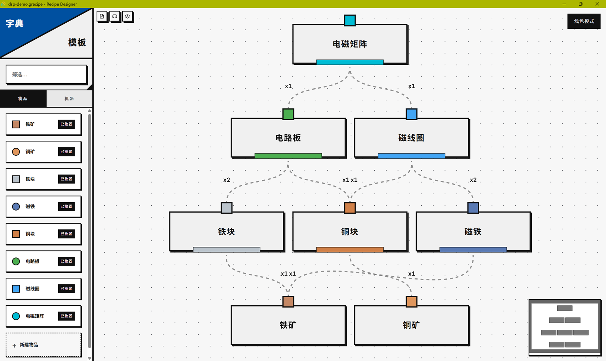
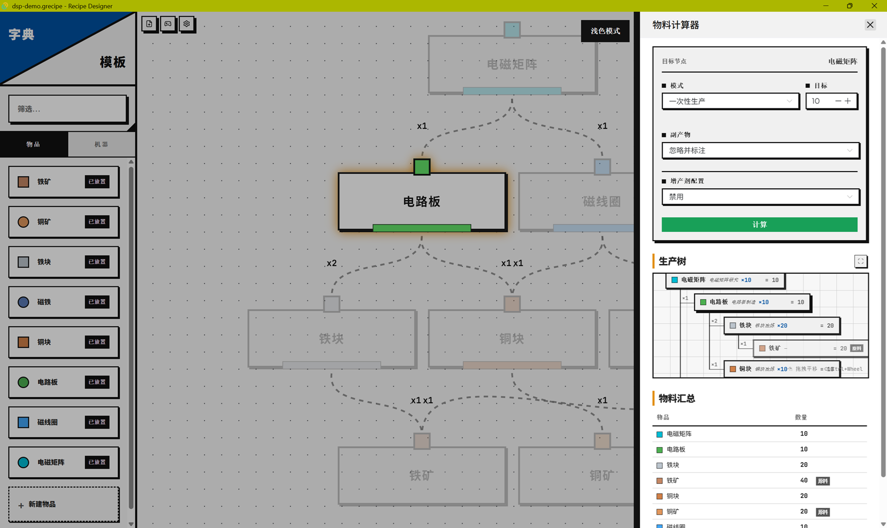

<h1 align="center">Recipe Designer</h1>

<p align="center">
  <strong>可视化工厂产线设计与物料计算工具</strong>
</p>

<p align="center">
  
  
  
  
  
</p>

<p align="center">
  <a href="README.md">English Documentation</a>
</p>

---

## 📖 项目简介

**Recipe Designer** 是一款用于可视化设计、组织与分析复杂工厂产线的桌面应用。受工厂自动化类游戏启发，它能够帮你对物品、机器、配方、副产物、催化剂以及全局效果进行建模，并通过物料计算（BOM）精确得出每一步需要多少原材料和机器。

将生产链条构建为节点与连线的图表，为每个物品配置多种可选配方，平衡副产物产出，应用产能倍率加成，并导出你的设计方案——所有操作都在一个精致的包豪斯风格界面中完成。

## 📸 界面截图

<p align="center">
  <strong>主编辑器</strong><br/>
  
</p>

<p align="center">
  <strong>物料计算器</strong><br/>
  
</p>

## ✨ 核心功能

### 图形编辑器
- **可视化图谱编辑** — 拖拽创建节点、连线、分组节点，支持画布平移和缩放
- **多配方槽系统** — 每个物品可配置多种生产配方，一键切换激活以对比效率
- **三种连线类型** — 输入（实线）、副产物（虚线）、催化剂（蓝色虚线）流连接
- **分组节点** — 将子工厂折叠为汇总节点，展示聚合后的输入与产出
- **自动布局** — 支持三种布局方向：自顶向下、自底向上、自左向右，基于 Sugiyama 分层布局算法并带有碰撞避免
- **5 种连线样式** — 简易贝塞尔、标准贝塞尔、直线、直角折线、平滑阶梯
- **选中高亮** — 点击任意节点或连线，高亮显示其上下游关联
- **深色 / 浅色主题** — 基于 CSS 变量的完整主题切换

### 配方与机器系统
- **机器编辑器** — 定义机器的基础速度、标签以及槽位配置（输入、输出、催化剂、增产剂）
- **配方槽** — 为每个配方配置生产耗时、产量、所需机器和相关标签
- **催化剂系统** — 支持可选 / 必需的催化剂，并可设置速度倍率
- **副产物输出** — 在主产物之外建模额外产出
- **全局效果** — 应用来自技能、宝物或研究的产量和速度倍率，可按目标标签筛选
- **增产剂配置** — 定义增产剂物品及其每周期消耗量

### 物料计算器 (BOM)
- **生产树视图** — 递归展开每个输入项，标注状态标志（循环检测、缺催化剂、基础原料、无配方）
- **物料汇总表** — 聚合展示所有物品的数量、速率和所需机器数
- **两种计算模式** — 一次性生产 / 持续生产（按每分钟速率）
- **取整选项** — 整数向上取整 / 精确小数
- **副产物策略** — 忽略并标注 / 抵扣需求 / 独立产出

### 效率工具
- **全局搜索** (Ctrl+P) — 快速定位任意节点、配方槽或机器
- **右键菜单** — 可配置的上下文菜单，显示对应快捷键
- **节点弹窗** — 紧凑的信息面板，快速浏览节点状态
- **字典面板** — 左侧边栏浏览物品和机器，拖拽至画布即可创建
- **模板系统** — 保存并可复用生产模式
- **数据校验** — 自动检查连线引用、配方槽引用、机器引用和标签匹配的完整性
- **自定义快捷键** — 所有快捷键均可重新绑定
- **文件持久化** — 通过 Tauri 原生对话框进行 `.grecipe` 格式的打开 / 保存 / 另存为
- **外部变更检测** — 自动检测文件在磁盘上被修改并提示重新加载

### 国际化
- **简体中文** 和 **English** 完整支持
- 所有界面文本、校验消息和物料计算输出均已本地化

## 🛠 技术栈

| 层级 | 技术方案 |
|:------|:-----------|
| **桌面外壳** | [Tauri v2](https://tauri.app/) (Rust) |
| **前端框架** | [Vue 3](https://vuejs.org/) (Composition API, `<script setup>`) |
| **开发语言** | TypeScript |
| **状态管理** | [Pinia](https://pinia.vuejs.org/) |
| **UI 组件库** | [Naive UI](https://www.naiveui.com/) |
| **图谱可视化** | [Vue Flow](https://vueflow.dev/) |
| **图谱布局** | [dagre](https://github.com/dagrejs/dagre) + 自定义 Sugiyama 布局（含碰撞避免） |
| **力导向模拟** | [d3-force](https://d3js.org/d3-force) |
| **图标** | [Lucide Vue Next](https://lucide.dev/) |
| **国际化** | [vue-i18n](https://vue-i18n.intlify.dev/) |
| **测试框架** | [Vitest](https://vitest.dev/) |
| **构建工具** | [Vite](https://vite.dev/) |

## 🚀 快速开始

### 环境要求

- **Node.js** ≥ 18
- **Rust** 工具链（Tauri 需要）— 通过 [rustup](https://rustup.rs/) 安装
- **系统依赖** — 请参照 [Tauri 前置要求](https://v2.tauri.app/start/prerequisites/)

### 安装步骤

```bash
# 克隆仓库
git clone https://github.com/Mowonhua/Recipe-Designer.git
cd recipe-designer

# 安装前端依赖
npm install
```

### 开发模式

```bash
# 纯 Web 开发服务器（Vite，端口 1420）
npm run dev

# 完整的 Tauri 桌面应用（含热重载）
npm run tauri dev
```

Vite 开发服务器固定运行在 **1420 端口**。Tauri 会自动先启动 Vite，再打开桌面窗口。

### 生产构建

```bash
# 构建桌面应用
npm run tauri build
```

构建产物位于 `src-tauri/target/release/`。

## 📚 使用指南

### 搭建产线

1. 打开左侧的**字典面板**，浏览物品和机器
2. **拖拽**物品到画布上创建节点
3. 从一个节点的输出端口**拖拽**到另一个节点的输入端口，创建流连线
4. 连线会自动在目标节点上创建配方槽，并将连接的物品作为输入
5. 点击节点 → **"详情"** 打开节点抽屉，配置配方、机器和催化剂

### 配方槽系统

每个节点可包含多个**配方槽**——即生产同一物品的不同方案：

- 设置**生产耗时**、**产量**，并分配**机器**
- 添加**标签**以匹配特定机器的要求
- 配置**催化剂模式**（无 / 可选 / 必需）及速度倍率
- 定义**副产物输出**

随时切换激活的配方槽，下游计算会自动更新。

### 物料计算器

1. 右键点击节点 → **"计算物料"**（或按 `Ctrl+B`）
2. 选择**一次性生产**或**持续生产**模式
3. 选择**取整策略**（整数向上取整 / 精确小数）
4. 选择**副产物处理策略**
5. 点击**计算**

**生产树**展示完整层级结构，并标注状态：
- `↻` — 检测到循环依赖
- `⚠` — 缺少必需的催化剂
- `⊘` — 没有激活的配方槽
- `∅` — 基础原料（无生产配方）

**物料汇总表**聚合所有物品，展示数量、每分钟速率和所需机器数。

### 分组与组织

- 选中节点 →  `Ctrl+G` 新建分组
- 分组**折叠**后显示聚合的输入 / 输出摘要
- 按 `Ctrl+Shift+G` 解散分组，恢复为独立节点

## 🎨 设计理念

界面遵循**包豪斯 / 至上主义**设计原则：

- **严格网格**布局，对齐精确
- **纯粹原色**——红、蓝、黄高对比度配色
- **零圆角**——通篇锐利几何边界
- **厚重块状阴影**——以坚实色块代替柔和辉光
- UI 文字使用 **Plus Jakarta Sans**，数据和连线标签使用 **JetBrains Mono** 等宽字体
- 节点通过 `color-mix(in srgb, ...)` 结合 CSS 自定义属性实现逐节点配色

设计令牌统一管理在 `src/styles/tokens.css` 中。组件共用样式集中于 `overlay.css` 和 `form.css`。在组件中书写硬编码值之前，请先检查这些文件——复用优先于重复。

## 🤝 参与贡献

欢迎贡献！请随时提交 Issue 和 Pull Request。

1. Fork 本仓库
2. 创建特性分支（`git checkout -b feature/amazing-feature`）
3. 遵循现有代码风格编写代码（Composition API、TypeScript 严格模式、CSS 令牌复用）
4. 运行测试（`npm test`）
5. 提交变更（推荐使用中文提交信息）
6. 推送并创建 Pull Request

重大变更请先提交 Issue 讨论你希望修改的内容。

## 📄 许可证

本项目基于 **MIT License** 开源——详见 [LICENSE](LICENSE) 文件。

## 🙏 致谢

- [Vue Flow](https://vueflow.dev/) — Vue 3 生态中出色的图谱可视化库
- [Naive UI](https://www.naiveui.com/) — 功能全面的 Vue 3 组件库
- [Tauri](https://tauri.app/) — 轻量、安全的桌面应用框架
- [dagre](https://github.com/dagrejs/dagre) — 分层图布局引擎
- 所有开源贡献者，是你们的库让本项目成为可能
